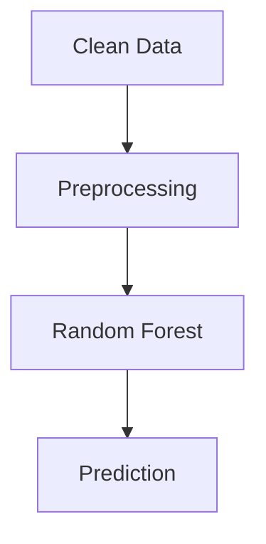
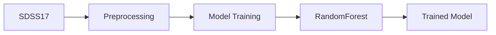

# Exist


A multiclass classifier for astronomicaç objects (**galaxy**, **star**, **quasar**) built with scikit-learn.

## Dataset

The dataset was taken from [SDSS17 photometric data](https://www.kaggle.com/datasets/fedesoriano/stellar-classification-dataset-sdss17/data). The dataset was explored in the [01_eda](notebooks/01_eda.ipynb) and cleaned in [02_data_cleaning](notebooks/02_data_cleaning.ipynb).
The variables that were used in the final model were the photometric values (`u`, `g`, `r`, `i` and `z`), `redshift` and the difference between adjacent photometric columns, color indices (`u_g`, `g_r`, `r_i` and `i_z`).

## Project Structure

```
exist/
├── data/            # Processed and raw data
├── models/          # Metadata and saved model
├── notebooks/       # Notebooks for data cleaning/analysis and model exploration
├── src/exist/       # Project source code
├── tests/           # Tests
└── pyproject.toml
```

## Model



The chosen model was Random Forest. `Random Forest` and `XGBoost` achieved the best cross-validation performance. `Random Forest` was selected based on its test performance, confusion matrix, and lower model complexity.

## Architecture



## Results

`Random Forest` results:

|     Model     | F1 macro (CV) | F1 macro (Test)  |
|---------------|---------------|------------------|
| Random Forest | 0.973 ± 0.001 |      0.98        |

## Getting Started

### Prerequisites
- Python 3.12+
- Git
- [uv](https://docs.astral.sh/uv/)

### Installation

Clone the repository and install the dependencies:

```bash
git clone https://github.com/luismanfredi/exist.git
cd exist
uv sync
```

## License

This project is licensed under the MIT License - see the [LICENSE](LICENSE) file for details.

## Author
**Luís Antonio Manfredi Sodré**
- [GitHub](https://github.com/luismanfredi)
- [Email](mailto:luismanfredi920@gmail.com)
